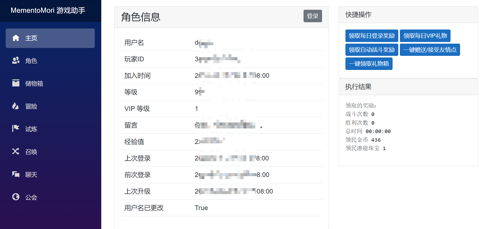
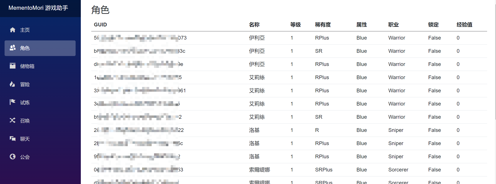
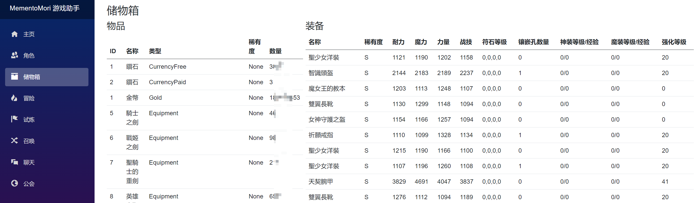
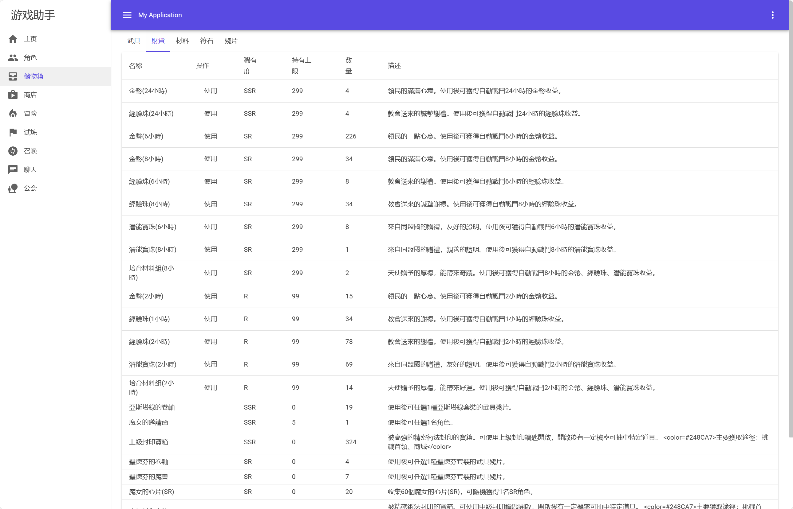
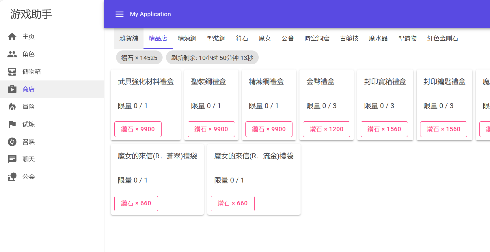
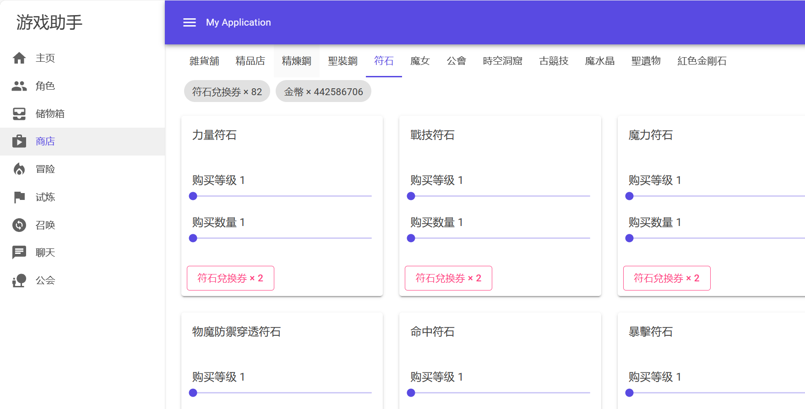
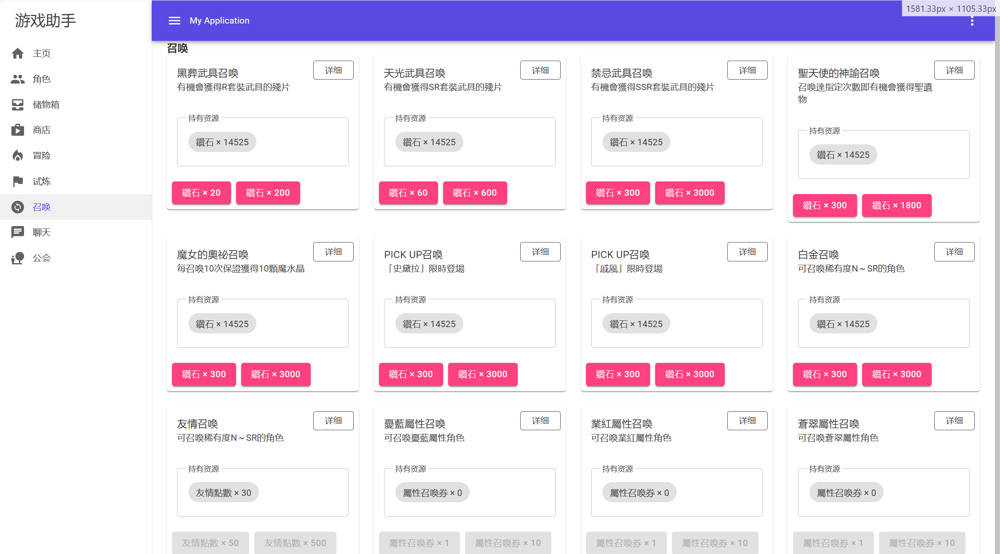
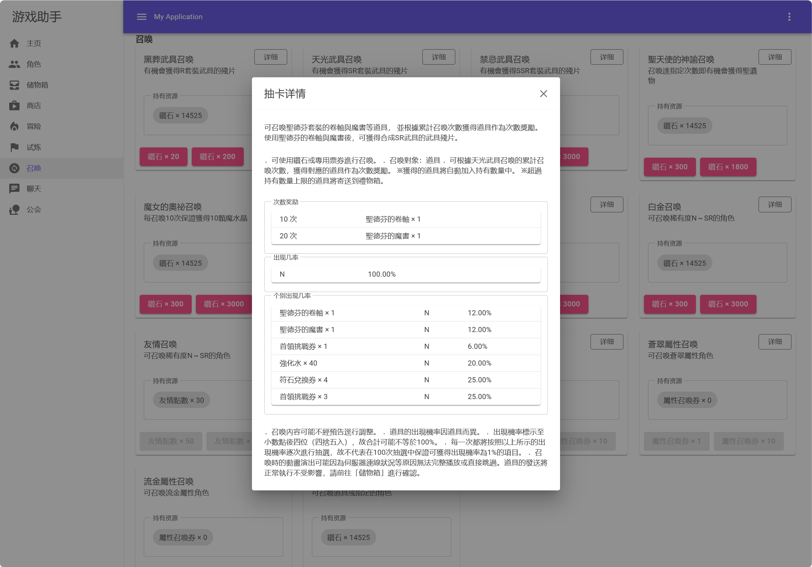

[ [Zh](readme.md) | [En](readme.en.md) ]

# MementoMori Game Assistant

[](https://github.com/moonheart/mementomori-helper/actions/workflows/publish-dev.yml)
[](https://github.com/moonheart/mementomori-helper/releases)
[](https://github.com/moonheart/mementomori-helper/releases)
[](https://github.com/moonheart/mementomori-helper/releases)
[](https://hub.docker.com/r/moonheartmoon/mementomori-webui/)

Under construction

[Telegram](https://t.me/+gTRe8AxKxIdkOTg9) [Discord](https://discord.gg/mJ3fWxrypx)

## **Disclaimer**

Please be aware of the following points when using this tool:
s
1. This tool is provided for personal entertainment and educational purposes. The use of this tool may violate the usage policies of specific games or applications, and users assume all associated risks.

2. The developer (referred to as "we") is not responsible for any legal or moral consequences that may arise from a user's use of this tool in games. Users should take full responsibility for the potential risks associated with using the tool.

3. Users should understand that developers of games or applications may take measures to detect and prevent the use of such assistance tools, which may result in users' accounts being banned or subjected to other sanctions.

4. Using this tool may potentially violate applicable laws. Users are responsible for ensuring that their usage complies with all relevant laws and regulations.

5. We reserve the right to change or discontinue this tool at any time without prior notice.

By downloading, installing, and using this tool, users acknowledge that they have carefully read and understood this disclaimer and agree to assume all risks associated with using this tool. If you do not agree with any part of this disclaimer, please discontinue the use of this tool.

## Previews
<table>
<tbody>
<tr><td> 

 </td><td></td></tr>
<tr><td>

</td><td></td></tr>
<tr><td>

</td><td></td></tr>
<tr><td>

</td><td></td></tr>
</tbody>
</table>
Here's the English translation of the provided document:

## Todos

<!-- prettier-ignore -->
<table>
  <tbody>
  <tr>
      <td>

- [x] Multi-account support
    - [x]Direct login with account and password
- [ ] Home
    - [x] User login
    - [x] Collect daily login rewards
    - [x] Collect daily VIP gifts
    - [x] One-click send/receive friendship points
    - [x] One-click collect gift box
    - [x] One-click collect task rewards
    - [x] One-click collect badge rewards
    - [x] One-click use fixed items
    - [x] Automatically collect monthly card rewards
- [ ] Exchange Shop
    - [x] Purchase regular items
    - [x] Purchase gems
    - [x] Auto-buy products
- [ ] Characters
    - [x] Character list
    - [x] Character attributes
    - [x] Character equipment details
    - [ ] Upgrade
    - [ ] Breakthrough
    - [ ] Formation

</td>
<td>

- [ ] Storage Box
    - [x] Automatically use items
    - [x] Automatically refine magic equipment and inherit to D-grade equipment
    - [x] Automatically inherit divine equipment to D-grade
    - [x] Automatically polish equipment
    - [ ] Manual use of items
- [ ] Adventure
    - [x] Collect automatic battle rewards
    - [x] One-click high-speed battle
    - [x] Boss one-click sweep
    - [x] Auto stage clearing
        - [x] Stop after a specified stage
- [ ] Trial
    - [x] Infinite Tower one-click sweep
    - [x] Auto stage clearing in the Infinite Tower
        - [x] Stop after a specified stage
    - [x] Phantom Temple one-click challenge
      - [x] Hitch a Ride Mode
      - [ ] Create Your Own Room Mode
      - [x] Configure Reward Weight
    - [x] Ancient Arena one-click challenge 5 times
    - [x] Fountain of Wishes one-click collect all
    - [x] Fountain of Wishes one-click expedition
        - [x] Optional tasks that dispatch specified reward items only
    - [x] Space-Time Cavern one-click automatic execution
        - [x] Optional automatic purchase of specified products
        - [x] Prioritize treasure chest nodes when available
        - [x] Automatically use recovery items
</td>
<td>

- [ ] Gacha
    - [x] Daily free/gold coin gacha
    - [x] Gacha pool list
    - [x] Manual gacha
- [ ] Guild
    - [x] Guild check-in
    - [x] Guild raid automatic sweep
    - [x] Automatically start the guild raid
    - [x] Collect guild battle rewards
- [ ] Others
    - [x] Support other automatic tasks while clearing stages
    - [x] Frequency limit for stage clearing configuration

</td>
</tr>

  </tbody>
</table>

## Usage

To run the program, follow these steps:

1. Go to the release page: https://github.com/moonheart/mementomori-helper/releases, and download the `publish-win-x64.zip` file. Unzip it.

### Method 1: Run Directly

To run the program, you need to configure your account information. After that, you can run `MementoMori.WebUI.exe`. Look for log messages like "Now listening on: http://0.0.0.0:5000". Open this address in your web browser.

### Method 2: Run with Docker

See [docker-compose](expamples/docker-compose)

## Automatic Tasks

The program will execute specific actions at certain times.

### Daily Tasks (Server Time 4:10)
- Collect daily login rewards
- Collect daily VIP rewards
- Collect automatic battle rewards
- Collect friendship points
- Collect gift box
- Strengthen equipment once (automatically selects the lowest-level equipment currently equipped by characters, used to complete daily tasks)
- Main story sweep 3 times
- Infinite Tower sweep 3 times
- Free high-speed battle (one free and one from the monthly card)
- Guild check-in
- Guild raid
- Fountain of Wishes collect rewards
- Fountain of Wishes automatic dispatch
- Space-Time Cavern automatic execution
- Collect daily/

weekly task rewards
- Use fixed items
- Consume item gacha
- Automatically advance characters (R->R+, SR->SR+)

### Reward Scheduled Collection (Server Time 0:30, 4:30, 8:30, 12:30, 16:30, 20:30)
- Collect daily login rewards
- Collect automatic battle rewards
- Fountain of Wishes dispatch+collect
- Guild raid
- Friendship points collection
- Task reward collection
- Guild battle reward collection
- Auto gacha
- Use fixed items

### Arena (Server Time 20:00)
- Arena 5 times (automatically selects the lowest power opponent from the list)

## Account Configuration

After launching the program, go to settings, add an account, and enter the account name, Transfer ID, and Transfer password.

## Function Description

### Daily Check-in Rewards

Automatically claim daily check-in rewards, cumulative check-in days rewards, and limited-time check-in rewards.

### VIP Daily Benefits

Automatically claim VIP daily free gifts.

### Monthly Strengthening Package

Automatically claim the monthly strengthening package.

### Auto Battle Rewards

Automatically claim rewards from auto battles.

### Friendship Points

Automatically send and receive friendship points.

### Strengthen Equipment Once

Used to complete the daily mission "Strengthen equipment 1 time."

Equipment selection strategy: Choose equipment with the lowest level among character-equipped equipment that has not reached its level limit.

### Challenge Boss 3 Times

Automatically use the daily 3 free attempts to challenge the boss. Prioritize using sweep, and if sweep is not unlocked, use regular challenge.

### Tower of Infinity 3 Times

Automatically use the daily 3 free attempts to challenge the Tower of Infinity. Prioritize using sweep, and if sweep is not unlocked, use regular challenge.

### Ancient Arena Auto Battle 5 Times

Automatically engage in 5 battles in the Ancient Arena.

Opponent selection strategy: Choose the player with the lowest combat power in the list.

### Peak Arena Auto Battle 10 Times

Automatically engage in 10 battles in the Peak Arena.

Opponent selection strategy: Choose the player with the lowest combat power in the list.

### Free High-Speed Battles

Automatically use the free 2-hour high-speed battle attempts.

### Free Summons

Automatically use items for card draws.

Item configuration: Options - Summons - Automatically consume items for card draws.

### Guild Check-in

Automatically claim daily guild check-in rewards.

### Guild Raid Battle

Automatically engage in guild raid battles. Prioritize using sweep, and if sweep is not unlocked, use regular challenge.

### Guild Raid Battle Opening

Automatically open the guild raid battle in the Lightsaber Guild.

### Guild Battle Defense Deployment

Automatically deploy defense on the guild's own bases in guild battles.

Deployment strategy: Deploy from large bases to small bases in order. For the first deployment, use a team of 5 characters; for subsequent deployments, use three teams of 3 characters each, with the remaining using 1 character.

Character selection strategy: Highest combat power to lowest.

### Guild Battle Rewards Claim

Automatically claim rewards from guild battles and cross-server guild battles.

### Phantom Temple

Automatically engage in battles in the Phantom Temple. The battle method is to randomly join an existing room.

#### Mission selection strategy:

When there is an event: Choose the mission with the highest number of event item rewards (first-time reward + fixed reward).

When there is no event: Select missions based on the configured reward weights in the options.

### Reward Weight

By going to Options - Phantom Temple, you can set the reward weight. The calculation method is as follows:

$$Sort=weight\times\frac{N_{start\_{current}}^{lv\_{current}}}{N_{start\_{max}}^{lv\_{max}}}$$

Suppose the settings are as follows:

- Rune Exchange Coupon: 5
- Potential Orb: 3

There are two tasks:

- Task A rewards with Rune Exchange Coupon x10. The reward for a 127-level 10-star task is Rune Exchange Coupon x100, calculated as $0.5 = 5 \times \frac{10}{100}$.
- Task B rewards with Potential Orb x30. The reward for a 127-level 10-star task is Potential Orb x2000, calculated as $0.045 = 3 \times \frac{30}{2000}$.

Ultimately, Task A will be chosen for the battle.

### Fountain of Wishes All Claim

Automatically claim rewards from the Fountain of Wishes.

### Fountain of Wishes Auto Expedition

Automatically send characters on expedition missions in the Fountain of Wishes.

You can set tasks that only include specified rewards in Options - Fountain of Wishes.

You can open Forced Expedition to ignore this setting.

You can click Refresh (Diamonds x20) to refresh regular tasks.

### Auto Purchase Shop Items

Automatically purchase items from the shop. You can set the consumed items, purchased items, and the minimum discount.

Default items to buy can be found in the options, and they are as follows. You can click Reset to Default to restore:
- Buy Life Tree Dew with any item at 20% OFF.
- Buy any item with coins at 0% OFF.

To add items for auto purchase, go to the left sidebar - Shop, click the alarm clock next to the item to open the auto purchase dialog, and configure:

- Items to buy, leave it empty to buy all items.
- Discount percentage, 0% OFF means no discount is required.
- Consumed items, leave it empty to consume any item.
- At least one of the purchase item and consumed item must be specified.

### Use Fixed Items

Automatically use items categorized as "Treasure Chest" with reward types "Fixed" or "Random," such as chests and unidentified gems.

### Batch Evolution

Automatically evolve R cards into R+, and SR cards into SR+.

### Memories

Automatically read all unread character memories to earn diamonds.

### Tasks - All Claim

Claim rewards for completed tasks.

### Tasks - Medal Rewards

Claim daily and weekly task medal rewards.

### Characters

You can access the character page from the left sidebar. Here, you can browse the basic information and equipment information of all characters.

### Storage Box

You can access the storage box page from the left sidebar. Here, you can browse all items and their information.

### Shop

You can access the shop page from the left sidebar. It is the same as the in-game shop, where you can buy items or gems and set up automatic item purchases.

### Summon

You can access the summon page from the left sidebar. It is the same as the in-game summon page, where you can draw cards, view draw details, and check the pity progress.

### Battle Records

You can access the battle records page from the left sidebar. Here, you can view the battle records of the main adventure and the Tower of Infinity, watch detailed battle information, and download JSON files for sharing or backup.

### Options

You can access the options page from the left sidebar. Here, you can view all settings and check information about automatic tasks.

## FAQs

### How do I run multiple instances?

To run multiple instances, modify the port number in `appsettings.user.json`. For example, change the port to 5700:

```json5
{
  {
    // original contents
  },
  "Kestrel": {
    "Endpoints": {
      "Http": {
        "Url": "http://localhost:5700"
      }
    }
  }
}
```
